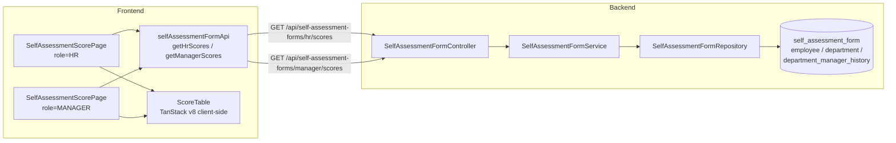

# Design Document

See `requirements.md` for the full feature specification. This document describes the implementation approach for the Self-Assessment Score View across backend and frontend.

## Architecture Overview

Two new role-gated endpoints on `SelfAssessmentFormController` return a list of `SelfAssessmentScoreListDto` for forms in the "submitted at least once" status set. The frontend injects two RTK Query endpoints, then renders a shared score-table page that branches on role for columns, summary cards, and filter controls. All filtering, searching, and pagination is client-side via TanStack Table v8.



## Backend Design

### Status-Filter Set

Two enum sets live as `private static final` fields on `SelfAssessmentFormService`:

```java
private static final Set<SelfAssessmentFormStatus> SCORE_VIEW_STATUSES = EnumSet.of(
    SelfAssessmentFormStatus.SUBMITTED,
    SelfAssessmentFormStatus.MANAGER_REVIEWED,
    SelfAssessmentFormStatus.APPROVED,
    SelfAssessmentFormStatus.REOPENED,
    SelfAssessmentFormStatus.PENDING_MANAGER_REVIEW,
    SelfAssessmentFormStatus.PENDING_EMPLOYEE_REVIEW,
    SelfAssessmentFormStatus.PENDING_FINAL_APPROVAL,
    SelfAssessmentFormStatus.PENDING_HR_CALIBRATION_REVIEW,
    SelfAssessmentFormStatus.FINALIZED_LOCKED
);
```

The same set is used as the inclusion filter in both queries. The repository queries pass the set via `IN (:statuses)`, so no entry for `DRAFT`, `NOT_STARTED`, or `NOT_SUBMITTED` can appear.

### DTO

`com.epms.backend.dto.selfassessmentform.SelfAssessmentScoreListDto` — new Java record:

```java
public record SelfAssessmentScoreListDto(
        Long id,
        EmployeeInfoDto employee,
        Long cycleId,
        String cycleName,
        String status,
        Double finalApprovedTotalScore,
        Double managerRevisedTotalScore,
        Double totalScore,
        String ratingCategory,
        Instant submittedDate
) {}
```

`EmployeeInfoDto` is reused verbatim so that department and position info travel with each row. The HR page consumes `employee.departmentName`; the Dept Head page ignores that field. Both endpoints return the same DTO — no separate HR-vs-manager shape — to keep wire surface minimal.

### Controller Endpoints

Added to `SelfAssessmentFormController`:

```java
@GetMapping("/hr/scores")
@PreAuthorize("principal.roleId == 1")
public ResponseEntity<ApiResponse<List<SelfAssessmentScoreListDto>>> getHrScoreForms(
        @AuthenticationPrincipal UserPrincipal principal);

@GetMapping("/manager/scores")
@PreAuthorize("principal.roleId == 2")
public ResponseEntity<ApiResponse<List<SelfAssessmentScoreListDto>>> getManagerScoreForms(
        @AuthenticationPrincipal UserPrincipal principal);
```

Both wrap the result in `ApiResponse.ok(...)` and use the same `try { ... } catch (RuntimeException ex) { return ResponseEntity.badRequest().body(ApiResponse.fail(ex.getMessage())); }` pattern used throughout the controller. Spring Security rejects unauthorized callers before the handler runs.

### Service Contracts

Added to `SelfAssessmentFormService`:

```java
@Transactional(readOnly = true)
public List<SelfAssessmentScoreListDto> getHrScoreForms();

@Transactional(readOnly = true)
public List<SelfAssessmentScoreListDto> getManagerScoreForms(Employee manager);
```

Contracts:

- `getHrScoreForms()` — returns every form whose status is in `SCORE_VIEW_STATUSES`, across all cycles and departments, mapped via a new `toScoreListDto(SelfAssessmentForm)` helper. No cycle scoping (the HR score view is intentionally historical, not "active cycle only"). Ordering: `submittedDate DESC NULLS LAST, id DESC`.
- `getManagerScoreForms(manager)` — resolves the set of department IDs currently managed by `manager` (see repository query below), then returns every form whose employee belongs to one of those departments and whose status is in `SCORE_VIEW_STATUSES`. If the manager manages zero departments the method returns `Collections.emptyList()` without touching `SelfAssessmentFormRepository`.

Both methods map with a new private helper:

```java
private SelfAssessmentScoreListDto toScoreListDto(SelfAssessmentForm form) { ... }
```

The helper builds `EmployeeInfoDto` the same way `toFormListDto` does and passes through the three score fields and `ratingCategory` verbatim (the frontend chooses the displayed score per Requirement 3).

### Repository Queries

Added to `SelfAssessmentFormRepository`:

```java
@Query("""
        SELECT f FROM SelfAssessmentForm f
        WHERE f.status IN :statuses
        ORDER BY f.submittedDate DESC NULLS LAST, f.id DESC
        """)
List<SelfAssessmentForm> findAllByStatusIn(
        @Param("statuses") Collection<SelfAssessmentFormStatus> statuses);

@Query("""
        SELECT f FROM SelfAssessmentForm f
        WHERE f.status IN :statuses
          AND f.employee.department.id IN :departmentIds
        ORDER BY f.submittedDate DESC NULLS LAST, f.id DESC
        """)
List<SelfAssessmentForm> findByStatusInAndEmployeeDepartmentIdIn(
        @Param("statuses") Collection<SelfAssessmentFormStatus> statuses,
        @Param("departmentIds") Collection<Long> departmentIds);
```

Managed-department lookup reuses the existing `DepartmentManagerHistoryRepository` (and, as a fallback, `Department.managerId`). In the service:

```java
private Set<Long> resolveManagedDepartmentIds(Employee manager) {
    LocalDate today = LocalDate.now();
    Set<Long> ids = new HashSet<>();
    // Active history rows: startDate <= today AND (endDate IS NULL OR endDate >= today)
    departmentManagerHistoryRepository
        .findActiveByManagerIdAsOf(manager.getId(), today)
        .forEach(h -> ids.add(h.getDepartment().getId()));
    // Fallback: legacy Department.managerId column
    departmentRepository.findByManagerId(manager.getId())
        .forEach(d -> ids.add(d.getId()));
    return ids;
}
```

If `DepartmentManagerHistoryRepository.findActiveByManagerIdAsOf` does not yet exist, it is added with the query above; otherwise the existing method is reused.

## Frontend Design

### File Layout

```
frontend/src/features/selfAssessmentForm/api/selfAssessmentFormApi.ts
  + getHrScoreForms          (injected)
  + getManagerScoreForms     (injected)
  + type SelfAssessmentScoreListDto

frontend/src/pages/self-assessment-form/
  + SelfAssessmentScorePage.tsx              // role-branching page
  + components/
      ScoreSummaryCards.tsx                  // dept-head only
      ScoreFilterBar.tsx                     // shared; accepts showDepartment prop
      ScoreTable.tsx                         // shared TanStack table
      ScoreCell.tsx                          // Displayed_Score + progress bar
      ScoreStatusBadge.tsx                   // thin wrapper over existing status config
  + hooks/
      useScoreFilters.ts                     // filter + search state
      useScoreRows.ts                        // resolve Displayed_Score, apply filters/search
```

All new components are regular function components with typed `props`; `React.FC` is not used.

### Route Registration (App.tsx)

- HR section: `<Route path="self-assessment/scores" element={<SelfAssessmentScorePage role="HR" />} />`
- Manager section: `<Route path="self-assessment-forms/scores" element={<SelfAssessmentScorePage role="MANAGER" />} />`

The parent routes already provide the `/hr` and `/manager` prefixes.

### RTK Query Endpoints

```typescript
export interface SelfAssessmentScoreListDto {
  id: number
  employee: EmployeeInfoDto
  cycleId: number | null
  cycleName: string | null
  status: string
  finalApprovedTotalScore: number | null
  managerRevisedTotalScore: number | null
  totalScore: number | null
  ratingCategory: string | null
  submittedDate: string | null
}

// inside baseApi.injectEndpoints(...)
getHrScoreForms: builder.query<SelfAssessmentScoreListDto[], void>({
  query: () => '/self-assessment-forms/hr/scores',
  providesTags: ['SelfAssessmentForm'],
  transformResponse: (response: unknown) =>
    getArray(getResponseData(response)).map(normalizeScoreListDto),
}),
getManagerScoreForms: builder.query<SelfAssessmentScoreListDto[], void>({
  query: () => '/self-assessment-forms/manager/scores',
  providesTags: ['SelfAssessmentForm'],
  transformResponse: (response: unknown) =>
    getArray(getResponseData(response)).map(normalizeScoreListDto),
}),
```

A small `normalizeScoreListDto` helper coerces numeric fields via the same pattern as existing `normalizeFormList`.

### Page Component

```tsx
type Role = 'HR' | 'MANAGER'

export function SelfAssessmentScorePage({ role }: { role: Role }) {
  const isHr = role === 'HR'
  const hrQuery = useGetHrScoreFormsQuery(undefined, { skip: !isHr })
  const mgrQuery = useGetManagerScoreFormsQuery(undefined, { skip: isHr })
  const query = isHr ? hrQuery : mgrQuery
  const rows = useScoreRows(query.data ?? [])          // adds displayedScore

  const filters = useScoreFilters({ includeDepartment: isHr })
  const filtered = useMemo(
    () => applyFilters(rows, filters.state),
    [rows, filters.state],
  )

  return (
    <div className="p-6 space-y-6">
      <Header role={role} />
      {!isHr && <ScoreSummaryCards rows={query.data ?? []} />}
      <ScoreFilterBar {...filters.bindings} showDepartment={isHr} />
      <ScoreTable
        rows={filtered}
        role={role}
        loading={query.isLoading}
        error={query.error}
      />
    </div>
  )
}
```

Styling matches `SelfAssessmentActiveFormsPage.tsx` — same header gradient, card radii, muted-slate filter chrome, and Tailwind utility patterns.

### Displayed Score Resolution

Single pure helper used by the table cell, the filter predicate, and the summary cards:

```typescript
export function resolveDisplayedScore(row: SelfAssessmentScoreListDto): number | null {
  if (row.finalApprovedTotalScore != null) return row.finalApprovedTotalScore
  if (row.managerRevisedTotalScore != null) return row.managerRevisedTotalScore
  return row.totalScore ?? null
}
```

### Filters, Search, Pagination (State Management)

`useScoreFilters` keeps local component state; nothing goes through Redux. Shape:

```typescript
interface ScoreFilterState {
  search: string                   // name search, case-insensitive substring
  departmentId: number | null      // HR only
  positionId: number | null
  cycleId: number | null
  status: string | null
  scoreMin: number | null
  scoreMax: number | null
}
```

`applyFilters(rows, state)` returns rows where, for every *active* filter (non-null / non-empty), the row's field matches. Score range uses `min <= displayedScore <= max`. Name search does `row.employee.employeeName.toLowerCase().includes(state.search.trim().toLowerCase())` when `search.trim()` is non-empty.

Pagination is delegated to TanStack Table:

```typescript
const table = useReactTable({
  data: filtered,
  columns,
  state: { sorting, pagination },
  onSortingChange: setSorting,
  onPaginationChange: setPagination,
  getCoreRowModel: getCoreRowModel(),
  getSortedRowModel: getSortedRowModel(),
  getPaginationRowModel: getPaginationRowModel(),
})
```

Page size selector offers 10 / 25 / 50 / 100. Whenever `filtered` changes length or `pageSize` changes, the page's effect resets `pagination.pageIndex` to `0`:

```typescript
useEffect(() => {
  setPagination((p) => ({ ...p, pageIndex: 0 }))
}, [filtered.length, pagination.pageSize])
```

### Columns

Shared column builders:

| Key | HR | Dept Head |
|---|---|---|
| Employee Name | ✓ | ✓ |
| Department | ✓ | — |
| Position | ✓ | ✓ |
| Period (cycleName) | ✓ | ✓ |
| Score (ScoreCell) | ✓ | ✓ |
| Performance (ratingCategory) | ✓ | ✓ |
| Status (ScoreStatusBadge) | ✓ | ✓ |
| Actions (View) | ✓ | ✓ |

View action href is computed by role:

```typescript
const viewHref = (role: Role, formId: number) =>
  role === 'HR'
    ? `/hr/self-assessment/reviews/${formId}`
    : `/manager/self-assessment-forms/reviews/${formId}`
```

### Summary Cards (Dept Head Only)

Computed from the *unfiltered* server response (per Requirement 5.3–5.5):

```typescript
const scored = rows.map(resolveDisplayedScore).filter((v): v is number => v != null)
const count  = rows.length
const avg    = scored.length ? scored.reduce((a,b)=>a+b, 0) / scored.length : null
const top    = scored.length ? Math.max(...scored) : null
```

When `count === 0`: Total Form Count shows `0`; Average and Top cards show `—`.

## Error Handling

Backend:

- Standard controller pattern: catch `RuntimeException`, return `ApiResponse.fail(ex.getMessage())` with HTTP 400. Spring Security itself returns 401/403 for unauthenticated / wrong-role calls.
- `getManagerScoreForms` short-circuits with `Collections.emptyList()` when the manager has no managed departments; no DB query runs.
- Repository queries are read-only and parameterized; no dynamic SQL assembly.

Frontend:

- RTK Query error surfaces as `query.error`; the table renders an inline error banner with a retry button, consistent with other list pages.
- `query.isLoading` shows a skeleton table.
- Empty result: table renders its empty state; Dept Head summary cards show `0` / `—` as specified.
- `resolveDisplayedScore` returns `null` when all three score fields are null; `ScoreCell` renders a `—` and a 0% progress bar.

## Correctness Properties

*A property is a characteristic or behavior that should hold true across all valid executions of a system — essentially, a formal statement about what the system should do. Properties serve as the bridge between human-readable specifications and machine-verifiable correctness guarantees.*

### Property 1: HR endpoint returns exactly the allowed-status set

*For any* set of persisted `SelfAssessmentForm` entities, the list returned by `getHrScoreForms()` equals the subset whose `status` is in `SCORE_VIEW_STATUSES` (no cycle or department scoping applied).

**Validates: Requirements 1.3, 1.4, 10.1, 10.2**

### Property 2: Manager endpoint is scoped to managed departments and allowed statuses

*For any* Dept_Head_User `m` and set of persisted forms, the list returned by `getManagerScoreForms(m)` equals the subset of forms whose `status` is in `SCORE_VIEW_STATUSES` AND whose `employee.department.id` is in the set of departments `m` currently manages (per `DepartmentManagerHistory` active as-of today, unioned with `Department.managerId`).

**Validates: Requirements 2.3, 2.4, 2.8, 10.1, 10.2**

### Property 3: Score DTO mapping is total and preserves required fields

*For any* `SelfAssessmentForm` entity, `toScoreListDto(form)` produces a `SelfAssessmentScoreListDto` whose `id`, `cycleName`, `status`, `finalApprovedTotalScore`, `managerRevisedTotalScore`, `totalScore`, `ratingCategory`, and `employee` (with department and position info) equal the corresponding entity values, and whose status string is never a value in `{DRAFT, NOT_STARTED, NOT_SUBMITTED}` when the entity was selected by Property 1 or Property 2.

**Validates: Requirements 1.6, 2.6, 10.3**

### Property 4: Displayed_Score resolution priority

*For any* row `r`, `resolveDisplayedScore(r)` returns `r.finalApprovedTotalScore` when it is non-null; otherwise `r.managerRevisedTotalScore` when it is non-null; otherwise `r.totalScore`.

**Validates: Requirements 3.1, 3.2, 3.3**

### Property 5: View action href is role-addressed

*For any* role `role ∈ {HR, MANAGER}` and any `formId`, the View action href equals `/hr/self-assessment/reviews/${formId}` when `role === 'HR'`, and `/manager/self-assessment-forms/reviews/${formId}` when `role === 'MANAGER'`.

**Validates: Requirements 4.4, 5.7**

### Property 6: Filter composition is logical AND of active filters

*For any* set of rows `R` and any filter state `S`, every row in `applyFilters(R, S)` satisfies every *active* filter in `S`, and every row in `R \ applyFilters(R, S)` violates at least one active filter. A filter is inactive iff its value is `null` or an empty string.

**Validates: Requirements 6.3, 6.5, 7.4, 7.6**

### Property 7: Name search is case-insensitive substring

*For any* row `r` and search string `q`, `r` is included by the name-search filter iff `r.employee.employeeName.toLowerCase().includes(q.trim().toLowerCase())`, and any `q` whose trimmed value is empty yields no restriction.

**Validates: Requirements 6.4, 7.5**

### Property 8: Score range filter is inclusive bounds on Displayed_Score

*For any* row `r` with non-null displayed score `d`, and any range `[min, max]` with both bounds set, `r` is included by the score-range filter iff `min <= d <= max`. When either bound is null, that side imposes no restriction.

**Validates: Requirements 6.6, 7.7**

### Property 9: Dept Head summary cards are derived statistics of the server response

*For any* list `rows` returned by the manager scores endpoint:
- Total Form Count equals `rows.length`.
- When `rows` contains at least one row with a non-null Displayed_Score, Average Score equals the arithmetic mean of those non-null Displayed_Scores and Top Score equals their maximum.
- When `rows` is empty or has no non-null Displayed_Score, Average Score and Top Score render as `—` and Total Form Count renders as `0`.

**Validates: Requirements 5.3, 5.4, 5.5, 5.8**

### Property 10: Pagination resets when the row set changes

*For any* transition where `filteredRows` length changes or `pageSize` changes, the table's `pageIndex` after the transition equals `0`, and the visible rows are `filteredRows.slice(0, pageSize)`.

**Validates: Requirements 8.4, 8.8**

### Property 11: Pagination navigation invariants

*For any* `filteredRows` and any sequence of next/previous/numbered-page interactions, the visible rows for `pageIndex = i` are `filteredRows.slice(i * pageSize, (i + 1) * pageSize)`; `next` increments `pageIndex` by 1 iff `(i + 1) * pageSize < filteredRows.length`; `previous` decrements `pageIndex` by 1 iff `i > 0`.

**Validates: Requirements 8.5, 8.6, 8.7**

## Test Strategy

- **Property tests (backend, JUnit + jqwik)**: Properties 1, 2, 3 against an in-memory `@DataJpaTest` fixture. Generators emit random forms across all statuses, random employees across random departments, and random `DepartmentManagerHistory` rows (some active, some ended). Minimum 100 iterations per property.
- **Property tests (frontend, Vitest + fast-check)**: Properties 4, 5, 6, 7, 8, 9, 10, 11 against the pure helpers (`resolveDisplayedScore`, `applyFilters`, href builder, summary stats, pagination slicing). Minimum 100 iterations per property.
- **Integration tests (backend, MockMvc)**: one happy-path and one forbidden-path per endpoint (HR role 1 → 200, role 2 → 403; manager role 2 → 200, role 1/3 → 403) plus the "manager with zero managed departments → empty list" edge case.
- **Example tests (frontend, Vitest + RTL)**: HR page renders correct columns in order without summary cards; Dept Head page renders summary cards and the Dept-Head column set without the Department column; View action navigates to the role-correct route; filter bar hides Department filter for Dept Head.
- **Smoke checks**: route registration in `App.tsx` for both paths; absence of `React.FC` in the new files (grep in CI).

Each property test is tagged `Feature: self-assessment-score-view, Property N: <title>` and cross-references this document.
